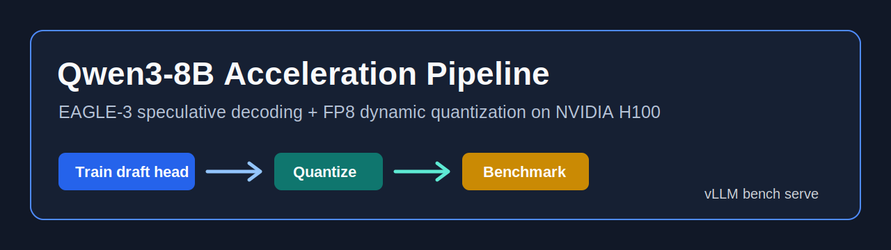

<p align="center">
  
</p>

# Qwen3-8B Speculative Decoding and FP8 Quantization

This repository contains the homework workflow for accelerating `Qwen/Qwen3-8B`
on 1x NVIDIA H100 80GB with:

- offline EAGLE-3 speculative decoding draft-head training;
- FP8 dynamic verifier quantization with `llmcompressor`;
- vLLM serving benchmarks for baseline, speculative, FP8, and combined FP8 + speculative decoding;
- final report notes answering the assignment questions.

## Deliverables

| File | Purpose |
| --- | --- |
| `spec_dec+quantization_homework.ipynb` | Assignment notebook with final report cells filled in. |
| `docs/ARCHITECTURE.md` | End-to-end architecture and data flow. |
| `docs/FINAL_REPORT.md` | Assignment answers, recommendation, benchmark tables, and interpretation. |
| `docs/BENCHMARK_RESULTS.md` | Benchmark command matrix and reference results. |
| `docs/RUNBOOK.md` | Step-by-step execution guide for the H100 machine. |
| `docs/GITHUB_REPO_BANNER.md` | Markdown snippet for the GitHub README banner. |
| `scripts/` | Reproducible setup, training, quantization, serving, and benchmark scripts. |

## Quick Start

Use Python 3.12 on the H100 host.

```bash
./scripts/bootstrap_envs.sh
./scripts/prepare_data.sh
```

Start the hidden-state extraction server in one terminal:

```bash
./scripts/launch_hidden_state_server.sh
```

Generate hidden states and train in another terminal:

```bash
./scripts/generate_hidden_states.sh
./scripts/train_eagle3.sh
```

Stop the hidden-state server, then quantize and create the combined serving checkpoint:

```bash
./scripts/quantize_fp8_dynamic.sh
./scripts/validate_quant_config.py models/Qwen3-8B-FP8-Dynamic
./scripts/make_fp8_speculator_checkpoint.sh
```

Print the benchmark command matrix:

```bash
./scripts/benchmark_commands.sh
```

## Defaults

All common settings live in `config/workflow.env`.

| Setting | Default |
| --- | --- |
| Model | `Qwen/Qwen3-8B` |
| Dataset | `sharegpt` |
| Samples | `3000` |
| Sequence length | `2048` |
| Benchmark dataset | `philschmid/mt-bench` |
| Benchmark concurrency | `8` |
| Benchmark prompts | `80` |
| EAGLE-3 checkpoints | `output/checkpoints/` |
| FP8 verifier | `models/Qwen3-8B-FP8-Dynamic` |

Override defaults inline:

```bash
MAX_SAMPLES=5000 SEQ_LENGTH=4096 ./scripts/prepare_data.sh
```

## Main Conclusion

For this workflow, train the speculative draft head first on BF16 verifier hidden
states, then quantize the verifier. Training first gives the draft head the
cleanest target distribution and avoids baking quantization noise into the
student. FP8 quantization can then be applied to the verifier for serving and
validated by acceptance rate, acceptance length, throughput, and TPOT.

## References

- Speculators: https://github.com/vllm-project/speculators
- Offline EAGLE-3 training: https://docs.vllm.ai/projects/speculators/en/latest/user_guide/tutorials/train_eagle3_offline
- FP8 dynamic quantization: https://github.com/vllm-project/llm-compressor/blob/main/examples/quantization_w8a8_fp8/README.md
