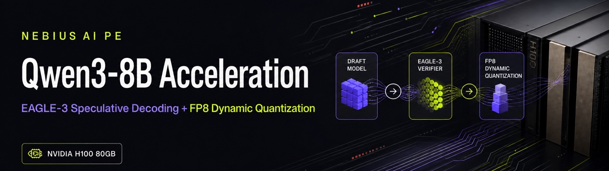

<p align="center">
  
</p>

<p align="center">
  <a href="https://www.python.org/"></a>
  <a href="https://pytorch.org/"></a>
  <a href="https://docs.vllm.ai/"></a>
  <a href="https://developer.nvidia.com/cuda-zone"></a>
  <a href="https://www.nvidia.com/en-us/data-center/h100/"></a>
  <a href="https://huggingface.co/Qwen/Qwen3-8B"></a>
</p>

# Qwen3-8B Speculative Decoding and FP8 Quantization

This repository contains the homework workflow for accelerating `Qwen/Qwen3-8B`
on 1x NVIDIA H100 80GB with:

- offline EAGLE-3 speculative decoding draft-head training;
- FP8 dynamic verifier quantization with `llmcompressor`;
- vLLM serving benchmarks for baseline, speculative, FP8, and combined FP8 + speculative decoding;
- final report notes answering the assignment questions.

## Deliverables

| File | Purpose |
| --- | --- |
| `spec_dec+quantization_homework.ipynb` | Assignment notebook with final report cells filled in. |
| `docs/ARCHITECTURE.md` | End-to-end architecture and data flow. |
| `docs/FINAL_REPORT.md` | Assignment answers, recommendation, benchmark tables, and interpretation. |
| `docs/BENCHMARK_RESULTS.md` | Benchmark command matrix and measured H100 results. |
| `docs/RUNBOOK.md` | Step-by-step execution guide for the H100 machine. |
| `docs/evidence/` | Copied VM evidence: benchmark JSONs, validation metrics, and FP8 config. |
| `scripts/` | Reproducible setup, training, quantization, serving, and benchmark scripts. |

## Quick Start

Use Python 3.12 on the H100 host.

```bash
./scripts/bootstrap_envs.sh
./scripts/prepare_data.sh
```

Start the hidden-state extraction server in one terminal:

```bash
./scripts/launch_hidden_state_server.sh
```

Generate hidden states and train in another terminal:

```bash
./scripts/generate_hidden_states.sh
./scripts/train_eagle3.sh
```

Stop the hidden-state server, then quantize and create the combined serving checkpoint:

```bash
./scripts/quantize_fp8_dynamic.sh
./scripts/validate_quant_config.py models/Qwen3-8B-FP8-Dynamic
./scripts/make_fp8_speculator_checkpoint.sh
```

Print the benchmark command matrix:

```bash
./scripts/benchmark_commands.sh
```

## Defaults

All common settings live in `config/workflow.env`.

| Setting | Default |
| --- | --- |
| Model | `Qwen/Qwen3-8B` |
| Dataset | `sharegpt` |
| Samples | `3000` |
| Sequence length | `2048` |
| Benchmark dataset | `philschmid/mt-bench` |
| Benchmark concurrency | `8` |
| Benchmark prompts | `80` |
| Assignment benchmark concurrency | `8` |
| Assignment benchmark prompts | `80` |
| Tuning benchmark concurrency | `32` |
| Tuning benchmark prompts | `256` |
| Serving max model length for final runs | `2048` |
| EAGLE-3 checkpoints | `output/checkpoints/` |
| FP8 verifier | `models/Qwen3-8B-FP8-Dynamic` |

Override defaults inline:

```bash
MAX_SAMPLES=5000 SEQ_LENGTH=4096 ./scripts/prepare_data.sh
```

## Main Conclusion

For this workflow, train the speculative draft head first on BF16 verifier hidden
states, then quantize the verifier. Training first gives the draft head the
cleanest target distribution and avoids baking quantization noise into the
student. FP8 quantization can then be applied to the verifier for serving and
validated by acceptance rate, acceptance length, throughput, and TPOT.

In the measured H100 assignment-profile run, FP8 + speculative decoding was the
fastest configuration: 1877.15 output tok/s versus 1168.59 for BF16 baseline.
All scored rows passed at the README/notebook benchmark concurrency of 8:
1276.33 tok/s for BF16 speculative serving, 1701.18 tok/s for FP8 serving, and
1877.15 tok/s for FP8 + speculative serving. A higher-load concurrency-32 run
is also preserved in `docs/evidence/benchmarks/`.

## References

- Speculators: https://github.com/vllm-project/speculators
- Offline EAGLE-3 training: https://docs.vllm.ai/projects/speculators/en/latest/user_guide/tutorials/train_eagle3_offline
- FP8 dynamic quantization: https://github.com/vllm-project/llm-compressor/blob/main/examples/quantization_w8a8_fp8/README.md
