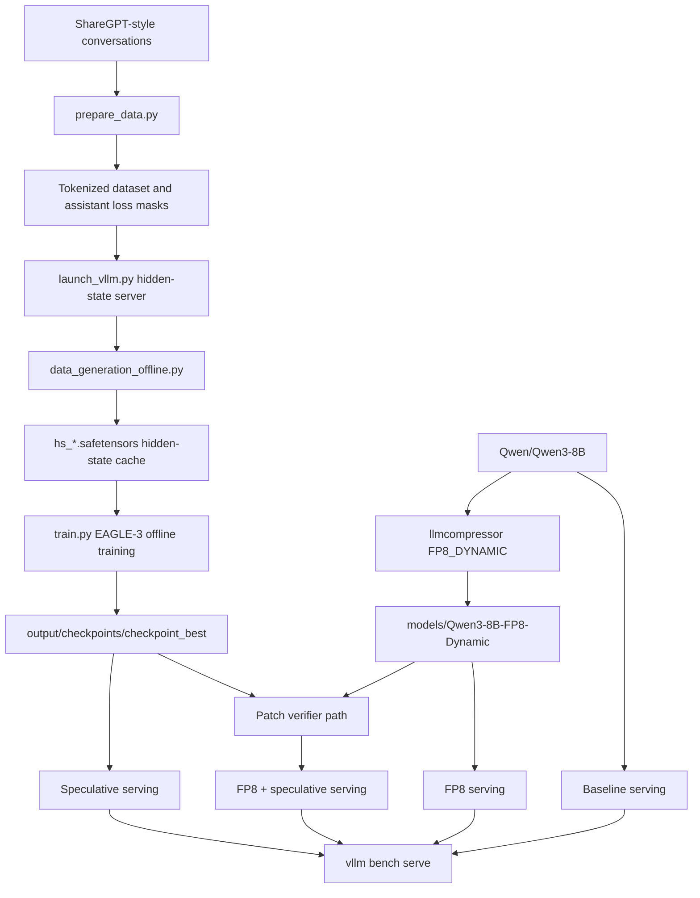

# Architecture

## Goal

Accelerate `Qwen/Qwen3-8B` serving on 1x NVIDIA H100 80GB by combining:

1. EAGLE-3 speculative decoding draft-head training.
2. FP8 dynamic quantization of the verifier model.
3. Fixed-setting vLLM serving benchmarks.

## Components

| Component | Environment | Role |
| --- | --- | --- |
| Speculators `v0.5.0` | `speculators_venv` | Prepare ShareGPT data, generate hidden-state training records, train EAGLE-3. |
| vLLM `v0.20.0` | `vllm_venv` | Hidden-state extraction server and serving benchmark runtime. |
| llmcompressor `v0.12.0` | `comp_venv` | FP8 dynamic quantization for verifier linear layers. |
| `Qwen/Qwen3-8B` | HF/local cache | BF16 verifier and EAGLE-3 training teacher. |
| `Qwen3-8B-FP8-Dynamic` | `models/` | Quantized verifier for serving. |
| `output/checkpoints/checkpoint_best` | `output/` | Best EAGLE-3 draft-head checkpoint. |

## Data Flow



## Execution Order

The key order is:

1. Train EAGLE-3 against the original BF16 verifier hidden states.
2. Quantize the verifier with FP8 dynamic quantization.
3. Benchmark baseline, speculative, FP8, and FP8 + speculative.

Training before quantization keeps the draft-head target distribution clean.
Quantization is then treated as a serving optimization whose impact is measured
through acceptance rate, acceptance length, throughput, and TPOT.

## Artifact Layout

```text
.
├── config/
│   └── workflow.env
├── docs/
│   ├── ARCHITECTURE.md
│   ├── BENCHMARK_RESULTS.md
│   ├── FINAL_REPORT.md
│   ├── GITHUB_REPO_BANNER.md
│   └── RUNBOOK.md
├── scripts/
│   ├── bootstrap_envs.sh
│   ├── prepare_data.sh
│   ├── launch_hidden_state_server.sh
│   ├── generate_hidden_states.sh
│   ├── train_eagle3.sh
│   ├── quantize_fp8_dynamic.py
│   ├── validate_quant_config.py
│   ├── make_fp8_speculator_checkpoint.py
│   ├── serve_model.sh
│   └── bench_one.sh
├── models/
│   └── Qwen3-8B-FP8-Dynamic/
└── output/
    ├── preprocessed/
    ├── hidden_states/
    ├── checkpoints/
    └── benchmarks/
```

`models/`, `output/`, virtual environments, and the cloned `speculators/`
source tree are ignored by git because they are large or reproducible.
